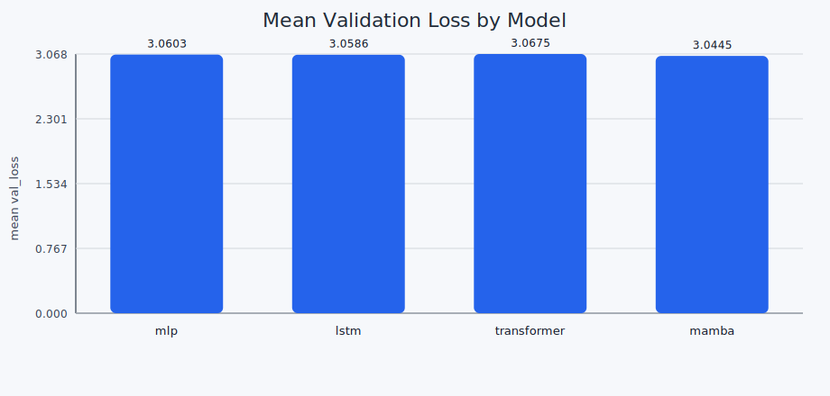
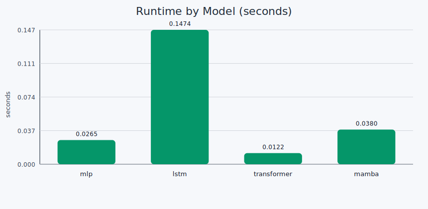

# Mamba From Scratch: CPU-Only C Benchmark Arena

A from-scratch C project that pits four sequence-model families against each other under one shared local training pipeline:

- `MLP`
- `LSTM`
- `Transformer` (single-head causal attention)
- `Mamba`-style selective state model

Everything runs on CPU, locally, with no external ML framework.

## Mission

Build a fair, transparent benchmark where architecture quality is compared under near-equal parameter budgets and identical data/training conditions.

## Why This Repo Is Useful

- Pure C implementation you can read end-to-end.
- Same dataset task and optimization loop for all models.
- Automatic parameter matching (`--match-params` enabled by default).
- Reproducible multi-seed benchmark scripts.
- Built-in summary + plots for quick interpretation.

## Fairness Rules

This benchmark enforces practical fairness by default:

- Same dataset and split.
- Same optimizer style (manual SGD updates).
- Same training schedule per benchmark run.
- Target-matched parameter count per model family.

The target budget is either:

- `--param-budget <N>` if provided, or
- inferred from the base Mamba shape (`d_model`, `hidden`) when omitted.

## Build

```bash
make
```

## CLI

```bash
./bin/train --help
```

Key options:

- `--model mlp|lstm|transformer|mamba|all`
- `--data <path>`
- `--epochs <int>`
- `--steps <int>`
- `--ctx <int>`
- `--dmodel <int>`
- `--hidden <int>`
- `--lr <float>`
- `--seed <int>`
- `--benchmark <csv_path>`
- `--param-budget <int>`
- `--no-match-params`

## One-Command Benchmark

```bash
scripts/run_benchmark.sh
```

What it does:

1. Builds the project.
2. Runs all four models for 5 seeds (`101, 202, 303, 404, 505`).
3. Uses parameter matching with target `2333` trainable parameters.
4. Writes per-run logs to `results/benchmark.csv`.
5. Writes aggregated ranking to `results/summary.csv` and `results/summary.md`.
6. Generates mean-performance plots in `plots/`.

## Latest Multi-Seed Result (Equal-Param Setup)

Benchmark configuration:

- dataset: `data/tinyshakespeare.txt`
- epochs: `4`
- steps per epoch: `700`
- context length: `32`
- base shape: `d_model=16`, `hidden=24`
- learning rate: `0.02`
- seeds: `5`
- parameter matching: `enabled`
- target parameters: `2333`

**Winner: `mamba`**

- Mean validation-loss margin vs runner-up (`lstm`): **`0.014044`**
- Relative to runner-up: about **`0.46%`** lower val-loss

| model | runs | d_model | hidden | target_params | params | mean_val_loss | std_val_loss | mean_val_acc | mean_seconds |
|---|---:|---:|---:|---:|---:|---:|---:|---:|---:|
| mamba | 5 | 16 | 24 | 2333 | 2333 | 3.044519 | 0.010842 | 0.170492 | 0.205555 |
| lstm | 5 | 16 | 11 | 2333 | 2268 | 3.058563 | 0.011252 | 0.180328 | 0.264905 |
| mlp | 5 | 16 | 3 | 2333 | 2279 | 3.060286 | 0.016558 | 0.180328 | 0.020158 |
| transformer | 5 | 18 | 0 | 2333 | 2341 | 3.067549 | 0.005747 | 0.180328 | 0.107348 |

## Plots

### Mean Validation Loss (lower is better)



### Mean Runtime (seconds, lower is faster)



## File Map

- Training engine and models: `src/main.c`
- Dataset sample: `data/tinyshakespeare.txt`
- Benchmark runner: `scripts/run_benchmark.sh`
- Summary generator: `scripts/summarize_results.py`
- Plot generator: `scripts/plot_results.py`
- Raw benchmark rows: `results/benchmark.csv`
- Aggregated ranking: `results/summary.csv`

## Notes

- This is a compact research-style baseline, not a production-optimized implementation.
- The current Mamba implementation is intentionally minimal but already competitive in this setup.
- If you increase sequence length and rerun multi-seed sweeps, the ranking can shift; always compare by aggregated metrics, not one seed.
